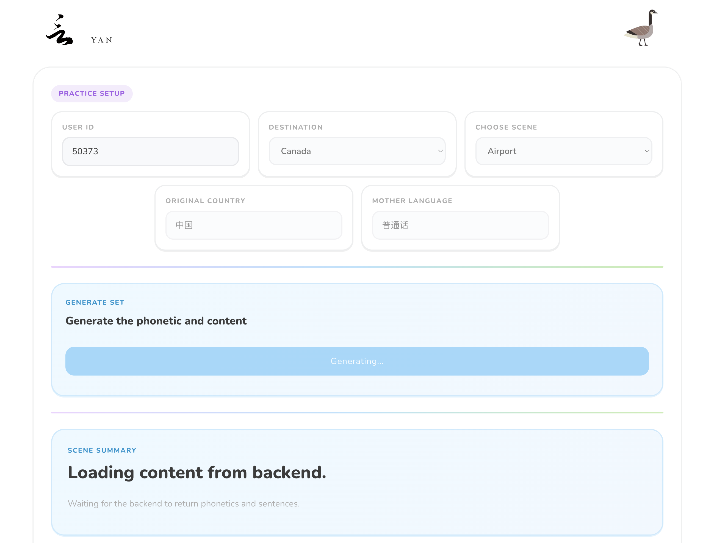

# Yan

Yan is a hackathon prototype that helps newcomers practice real-world English conversations before they face them in daily life.

The project focuses on high-stress situations such as the airport, the supermarket, IRCC-related interactions, and neighborhood conversations. Instead of showing generic language exercises, Yan generates phonetic hints and short dialogue practice based on the learner's background and selected scenario.

## Demo Screenshots

### Page 1: setup and content generation



### Page 2: airport dialogue practice


## Problem

Many newcomers know some English, but still struggle when they need to react quickly in unfamiliar situations. The gap is not only vocabulary. It is confidence, pronunciation, listening, and context.

Yan is designed to make those first interactions feel less intimidating by turning practical situations into guided speaking practice.

## What The Prototype Does

- Lets the user choose a destination, scenario, original country, and mother language.
- Requests tailored practice content from a backend service.
- Blocks the UI with a full-screen loading overlay while content is being generated, so the state is clear and consistent.
- Shows a phonetic preview on Page 1 before entering the scene.
- Opens a dialogue-practice view with scene-specific visuals on Page 2.
- Supports sentence playback and word-by-word pronunciation lookup.
- Falls back to browser speech synthesis, with optional provider-based TTS support through env vars.

## Demo Flow

1. Open `Page1` at `/`.
2. Select the learner setup and scene.
3. Generate pronunciation and dialogue content from the backend.
4. Review the phonetic preview.
5. Enter the scene and practice the generated dialogue on `/p2/:sceneId`.
6. Tap words to inspect pronunciation and replay speech.

## Stack

- React 19
- TypeScript
- Vite
- React Router
- Browser Speech Synthesis API
- Backend APIs for generated content and phonetic lookup

## Project Structure

- `/Users/jiucheng/Dev/Yan/src/pages/Page1.tsx`
  The setup and generation flow.
- `/Users/jiucheng/Dev/Yan/src/pages/Page2Dialogue.tsx`
  The interactive dialogue practice experience.
- `/Users/jiucheng/Dev/Yan/src/services/phoneticsService.ts`
  Word-level phonetic lookup.
- `/Users/jiucheng/Dev/Yan/src/services/ttsService.ts`
  Browser/provider text-to-speech playback.
- `/Users/jiucheng/Dev/Yan/docs/images`
  Demo screenshots used in project documentation.

## Local Setup

1. Install dependencies:

```bash
npm install
```

2. Configure local env values in `/Users/jiucheng/Dev/Yan/.env.local`:

```env
VITE_API_BASE_URL=/api/v1
API_PROXY_TARGET=http://127.0.0.1:8000
```

3. Start the app:

```bash
npm run dev
```

## Scripts

- `npm run dev`
- `npm run build`
- `npm run lint`
- `npm run preview`

## Notes

- Frontend env files must live at `/Users/jiucheng/Dev/Yan/.env` or `/Users/jiucheng/Dev/Yan/.env.local`.
- Only `VITE_` variables are exposed to frontend code.
- Restart the dev server after changing env files.

## Hackathon Direction

This prototype is aimed at validating one core idea: scenario-based language practice can feel more useful and more approachable when it is personalized to the learner's context and presented as an interactive experience rather than a static lesson.
